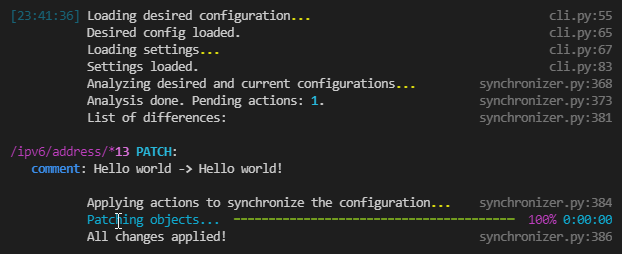

# MTsync

MTsync aims to be a building block for a GitOps approach to Mikrotik device management. It consumes a desired configuration tree and applies it to a live device.

## Usage

In order to use this tool your device must be running a version of RouterOS that has the [REST API](https://help.mikrotik.com/docs/display/ROS/REST+API) available, **configured** and enabled.

Secondly you need to prepare a JSON file (or stream) that'll describe a desired state of your device. Here's an example:

```
{
    "ipv6": {
        "address": [
            {
                "interface": "bridge",
                "address": "2010::7/64",
                "disabled": "false"
            },
            {
                "interface": "bridge",
                "address": "2010::1/64",
                "disabled": "false",
                "comment": "Hello world!"
            }
        ]
    },
    "ip": {
        "settings": {
            "rp-filter": "no"
        }
    }
}
```

Here you can find a couple of rules about how this piece of software works internally:

- Key names are direct mappings of an internal RouterOS tree as seen on CLI.
- Dynamic elements are ignored completely.
- Every list of elements will be updated to contain only the specified entries - extra elements will be deleted, missing elements will be added, existing/partially matching elements will be updated.
- Only the specified keys of the elements will be synchronized/updated.
- Only the specified tree elements will be synchronized/updated.
- If you want to delete a key - set it to an empty string.
- All values must be passed as strings (this may change in future).
- List elements will be updated first, then new elements will be created, then extra elements will be deleted and finally loose settings will be updated.
- There are no "creative" ordering changes to make this tool "smart" and prevent accidental connection interruptions. You must apply your changes incrementally.

Finally you need to run the tool itself:

```
 mtsync --hostname=192.168.1.1 --desired-file=examples/example_input.json --ignore-certificate-errors
```



## Connection details

Connection details like hostname, username and password may be specified using 3 different ways: CLI arguments, environment variables and `metadata` key in your configuration. Variable names/keys are synchronized in all 3 places.

Device config can be read from a file (using `--desired-file` option) or from standard input (when no such option is specified).

By default it will connect as `admin` with empty password to `192.168.88.1`, as these are the defaults for the OS.

## Building

```
poetry run pip freeze | grep -v mtsync > requirements.txt && pex -D . -r requirements.txt -m mtsync.cli -o dist/mtsync
```

## Installation
